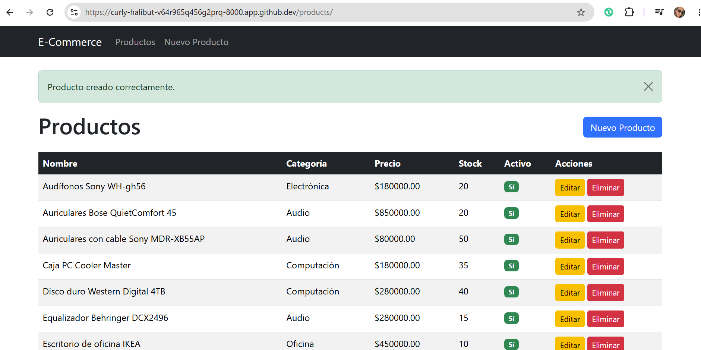
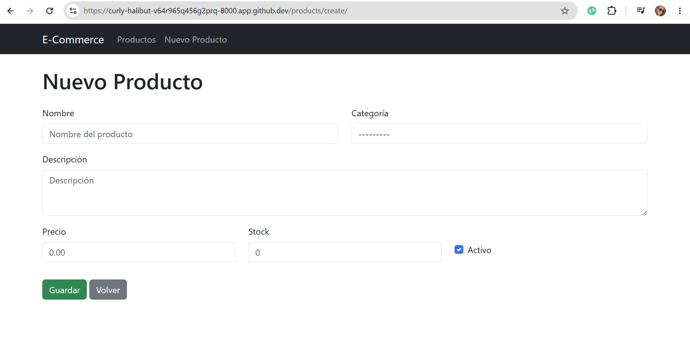
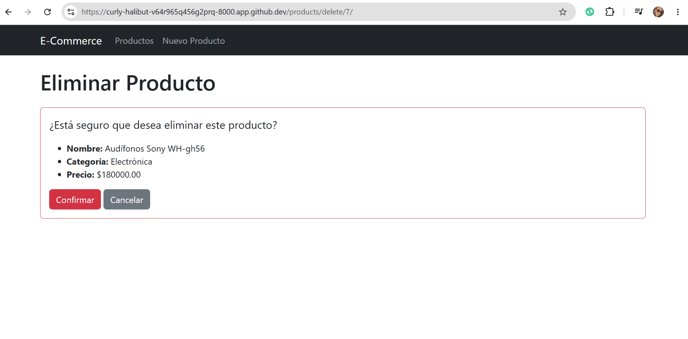

# E-Commerce M7

Proyecto Django para administración de productos de un e-commerce.

## Motor de base de datos

Se utiliza **PostgreSQL** como motor de base de datos relacional.

## Modelo de datos

### Categoria

| Campo    | Tipo         | Restricciones |
| -------- | ------------ | ------------- |
| id       | AutoField    | Clave primaria |
| nombre   | CharField    | max_length=100, único |

### Producto

| Campo          | Tipo           | Restricciones                       |
| -------------- | -------------- | ----------------------------------- |
| id             | AutoField      | Clave primaria                      |
| nombre         | CharField      | max_length=100                      |
| descripcion    | TextField      |                                     |
| precio         | DecimalField   | max_digits=10, decimal_places=2, > 0 |
| stock          | PositiveIntegerField |                                |
| categoria      | ForeignKey     | → Categoria, on_delete=CASCADE      |
| fecha_creacion | DateTimeField  | auto_now_add=True                   |
| activo         | BooleanField   | default=True                        |

## Rutas principales

| Método | Ruta                    | Vista              | Descripción              |
| ------ | ----------------------- | ------------------ | ------------------------ |
| GET    | `/products/`            | lista_productos    | Listado de productos     |
| GET    | `/products/create/`     | crear_producto     | Formulario de creación   |
| POST   | `/products/create/`     | crear_producto     | Guardar nuevo producto   |
| GET    | `/products/edit/<id>/`  | editar_producto    | Formulario de edición    |
| POST   | `/products/edit/<id>/`  | editar_producto    | Actualizar producto      |
| GET    | `/products/delete/<id>/`| eliminar_producto  | Confirmar eliminación    |
| POST   | `/products/delete/<id>/`| eliminar_producto  | Eliminar producto        |
| GET    | `/admin/`               | Admin Django       | Panel de administración  |

## Pasos para ejecutar el proyecto

```bash
# 1. Clonar el repositorio
git clone <repo-url>
cd ecommerce_m7

# 2. Activar el entorno virtual
source venv/bin/activate

# 3. Instalar dependencias
pip install -r requirements.txt

# 4. Configurar PostgreSQL
#    Asegúrate de tener PostgreSQL corriendo y crea la base de datos:
#    CREATE DATABASE ecommerce_db;

# 5. Ejecutar migraciones
python manage.py migrate

# 6. Crear superusuario (opcional, para acceder al admin)
python manage.py createsuperuser

# 7. Iniciar servidor
python manage.py runserver

# 8. Abrir en el navegador
#    http://localhost:8000/products/
#    http://localhost:8000/admin/
```

## Evidencias

### Listado de productos



### Formulario de creación / edición



### Confirmación de eliminación


